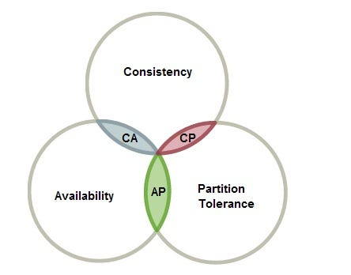
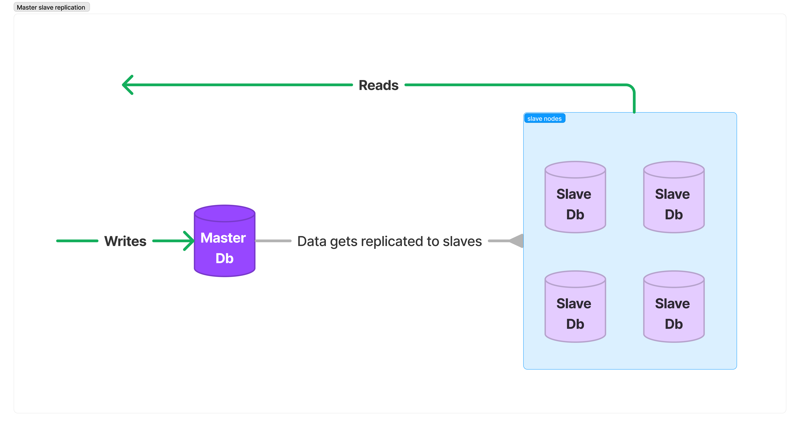

# **Database Replication Strategies**

This blog summarizes the key database replication techniques. At the end of the post, the reader can find the refer
ences to the sources used, and some further reading:

## **Table of Contents**:
- [Motivation behind Database Replication.](#motivation-behind-database-replication)
- [Master-slave Replication Strategy.](#master-slave-replication-strategy)
- [Multi-master Replication Strategy.]()
- [Circular Replication Strategy.]()
- [References]()

## **Motivation behind Database Replication**
Your application is as scaled as your database. I heard this quote a year ago in a local tech meetup. It is very simple, yet very clear quote. In the context of software engineering along with scaling the backend servers to serve dynamic user base, an interesting, yet challengging at the same time issue is to scale the data layer of the application to handle queries in the most optimal and cost efficient way possible.   
Apart from scalability and load balancing, the other challenge is to increase the fault-tolerance and resiliency of the the overall system which can be achieved by reducing the so called 'single point of failure's in the system and devicing effective failover mechanisms.  
This is where database replication comes handy. By replicating the application data across multiple database servers, not only you can load off the balance from the single storage unit (thus improving load balancing and system scalability), but also you create failover accross the data layer of the application, in which case if one database server goes off, the other replica can serve to the clients. 
However, as everything in life, database replication comes with its own challenges, and issues. One particular challenge is to ensure the consistency of database transactions is compliance with the system design requirements which mostly is governed by the CAP (consistency, availability, partition tolerance) theorem (more on CAP theorem later).   

 

 

That's why engineers came up with various database replication strategies to adress these challenges.  In this blog post, I will talk about three of the main strategies, which are **Master-slave replication**, **Multi-master replication** and **Circular replication** strategies.   

## **Master-slave Replication Strategy**

Master-slave replication is probably the most widely known and used replication strategy, and more recently it is also referred to as *main-replica* replication  in the modern terminology. Figure below shows the visual description of this technique:  
 

 

The basic premise of this technique is that most applications have more read queries than writes. By allocating multiple database servers for read requests, the load can be balanced across multiple clients. In this way the system will be comprised of a master which accepts wirte transactions, the updates of which are then replicated to slave databases.   
There are two main nuances to consider when deploying this pattern:

1. **Consistency**:  
The replicaion between master and slave databases can be either **syncronous** or **asyncronous** the choice of which depends on the design requirements.  
If the **consistency across transactions** is critical then syncronous replication should be deviced in which case before committing a write transaction, the master database awaits the replica databases to commit the transaction. While this ensures the data is in consistent state across the system, in introduces additional latency for write operations. These type of systems are usually referred to as **strongly consistent** systems.   
If the **system requirements do not demand strong consistency** across the database reads, then asyncronous replicastion can be the choice. In this case the master database commits the write transactions without waiting for any acknowledgment from replica databases. While this improves system latency, if a write transaction fails in a replica database, or if the master database fails before replication is complete then there will be data loss across the system. 

2. **Failover**:  
One of the most critical questions in distributed computing is what happens if one of tbe nodes in system fails. In the case of master-slave database replication, there are two states:
    -  A slave node fails. In this case all the requests forwarded to it will be forwared to other active replica nodes. To restore the system to desired state the system controller will then spawn another replica database instance and populate it with data. In some systems, an additional idle replica instance is kept to be used in the case of failover.
    - The master node fails. In this case one of the slave databases will be elected as the new temporary master database until the master database is fixed or new master instance is deployed. One of the main issues in this case is the question of what happens if the elected replica does not contain the most up-to-date data. That brings the topic of database backup techniques to the table. (which will be investigated in the next blogs.)

## **Multi-master Replication Strategy**
